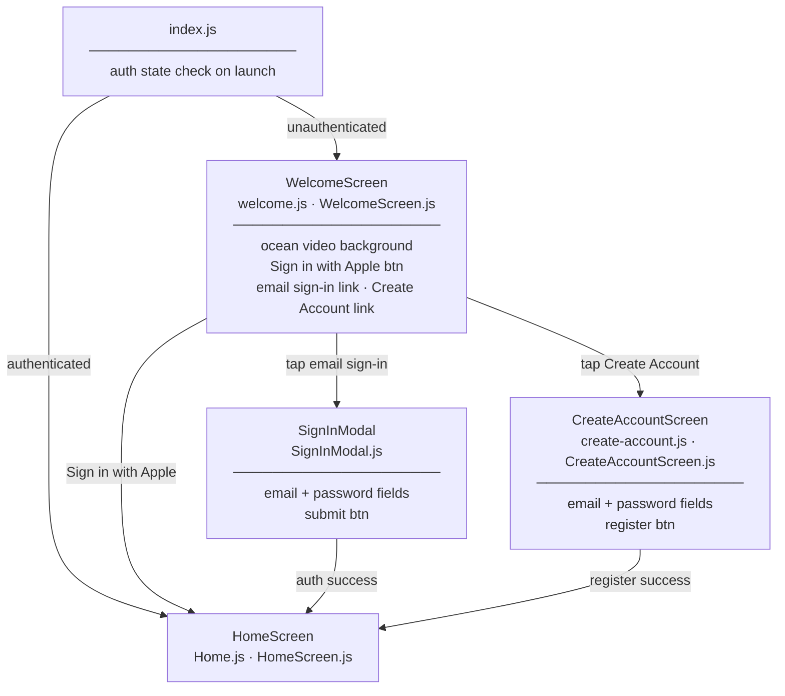
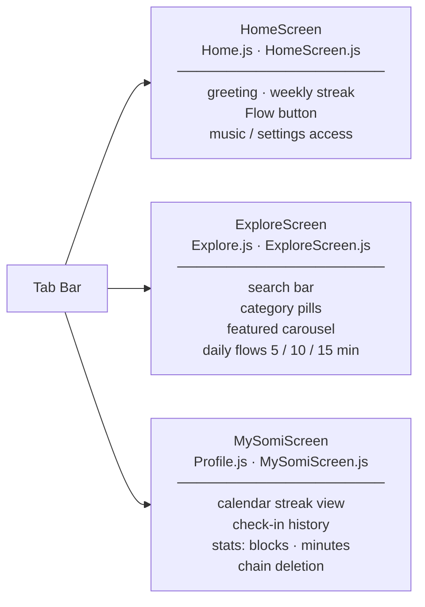
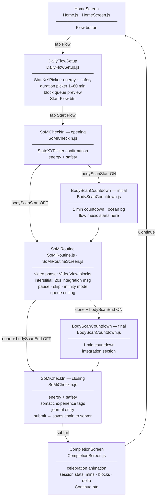
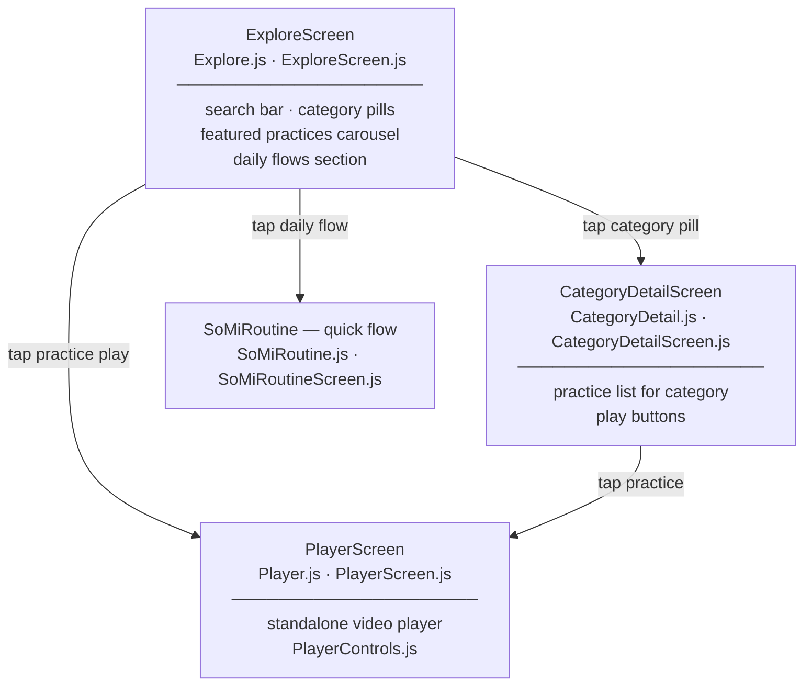
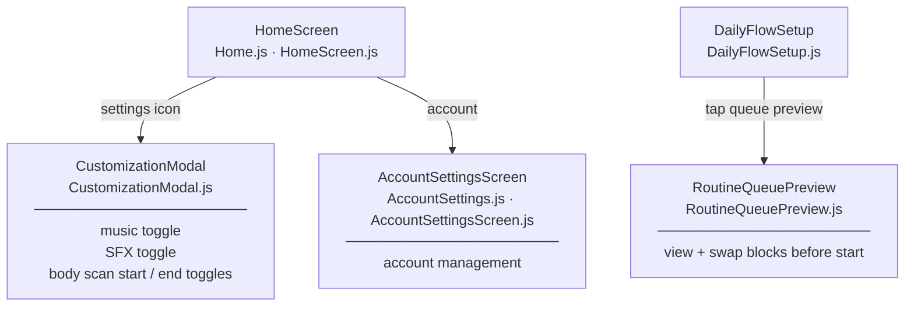

# Flows — Screen Transitions

All flows verified from navigation code in `mobile/app/_layout.js` and component implementations.

## Auth Flow

1. App launches → `index.js` checks auth state
2. If unauthenticated → `(auth)/welcome`
   - Tap "Sign in with Apple" → Apple auth → redirect to `(tabs)/Home`
   - Tap email sign-in → `SignInModal` → auth → redirect to `(tabs)/Home`
   - Tap "Create Account" → `(auth)/create-account` → register → redirect to `(tabs)/Home`
3. If authenticated → `(tabs)/Home`

## Daily Flow (primary loop)

1. **Home** → tap "Flow" button → navigate to `DailyFlowSetup`
2. **DailyFlowSetup**
   - User drags 2D StateXYPicker (energy 0-100, safety 0-100)
   - User picks duration (1-60 min, default 10)
   - App calls `POST /api/flows/generate` with state + duration
   - Block queue preview displayed (body scan bookends if enabled in settings)
   - Tap "Start Flow" → navigate to `SoMiCheckIn` (opening)
3. **SoMiCheckIn (opening)**
   - User confirms/adjusts energy+safety on StateXYPicker
   - Check saved to session (AsyncStorage, not yet to server)
   - Navigate to `BodyScanCountdown` (initial) if `bodyScanStart` enabled, else `SoMiRoutine`
4. **BodyScanCountdown (initial)** — 1 min countdown, ocean background
   - Flow music starts here
   - Block saved (BODY_SCAN_BLOCK_ID = 20, section: "warm-up")
   - Navigate to `SoMiRoutine`
5. **SoMiRoutine** — loops through video blocks:
   - Phase: `video` — plays current block video (muted, VIDEO_DURATION_CAP = 60s)
   - Phase: `interstitial` — 20s pause with integration message (rotating every 10s)
   - User can: pause/resume, skip block, toggle infinity mode on interstitial, edit queue, access settings
   - Each completed block saved to session
   - After last block → navigate to `BodyScanCountdown` (final) if `bodyScanEnd` enabled, else `SoMiCheckIn` (closing)
6. **BodyScanCountdown (final)** — 1 min countdown
   - Block saved (BODY_SCAN_BLOCK_ID = 20, section: "integration")
   - Navigate to `SoMiCheckIn` (closing)
7. **SoMiCheckIn (closing)**
   - User sets energy+safety, selects somatic experience tags, optional journal entry
   - On submit: `createChainFromSession()` — batch creates chain + uploads all checks + entries to server
   - Navigate to `CompletionScreen`
8. **CompletionScreen**
   - Shows celebration animation, session stats (total minutes, blocks, state transformation)
   - Flow music stops
   - Tap "Continue" → navigate to Home

## Quick Routine Flow [INFERRED]

Referenced in `chainService.js` and `routineStore.js` as `flowType: 'quick_routine'`. Appears to use direct API calls (not session buffering) for saving blocks/checks. Flow type `'single_block'` also referenced in routineStore. The exact entry point for quick routines from the UI is through the Explore tab's pre-built flows.

## Timer Flow

1. Navigate to `SoMiTimer` (entry point: UNKNOWN — no direct navigation found in main tabs)
2. Timer counts down (MM:SS), breathing animation plays
3. On finish: saves block (TIMER_BLOCK_ID = 15)
4. Navigate back

## Explore Tab

- Search bar filters practices
- Category pills: vagal_toning, havening, humming, movement, gaze_work, etc.
- Tap category → `CategoryDetail`
- Featured practices carousel with play buttons
- Daily Flows section: 6 pre-built flows (Wake Up 5min, Wind Down 5min, Morning Flow 10min, Deep Rest 10min, Full Morning 15min, Night Restore 15min)

## Stubbed / Partially Wired

- **SoMiTimer**: registered in navigation stack but entry point from UI is not obvious [INFERRED]
- **Streak count** on CompletionScreen: shows "TODO" placeholder [VERIFIED — comment in CompletionScreen.js]
- **Customization modal** on Home: toggles for music, SFX, body scan start/end [VERIFIED]

---

## Navigation Diagrams

Each node shows the screen name, filenames, and key UI elements.

### 1. Auth Flow

---

### 2. Main Tabs

---

### 3. Daily Flow Journey

---

### 4. Explore Sub-Navigation

---

### 5. Home Modals & Settings

