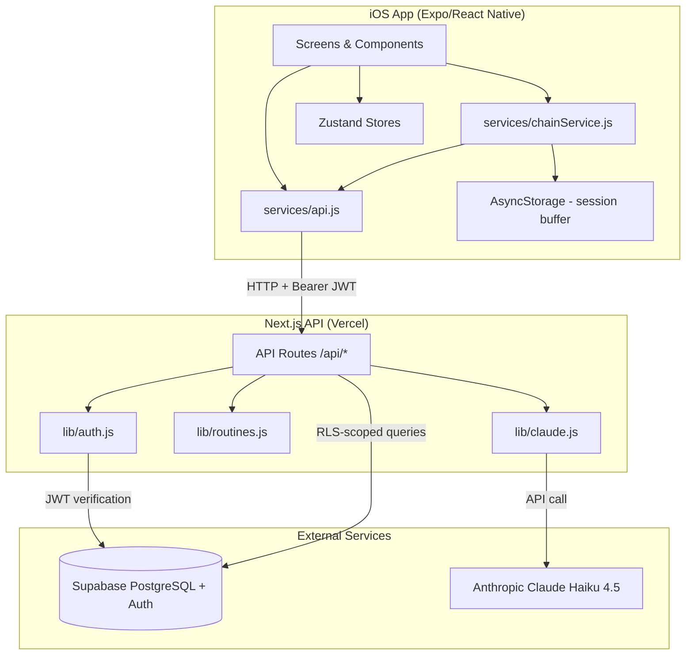

# Architecture

## System Map



## Components

### Mobile (iOS only)
- **Framework**: React Native + Expo SDK ~54 [VERIFIED — `mobile/app.config.js`]
- **Navigation**: Expo Router (file-based routing) with NativeTabs [VERIFIED]
- **State**: Zustand stores (`authStore`, `routineStore`, `settingsStore`, `flowMusicStore`) [VERIFIED]
- **Server communication**: All requests go through `services/api.js` — no direct Supabase queries from mobile [VERIFIED — `mobile/CLAUDE.md` rule]
- **Session buffering**: `chainService.js` uses AsyncStorage to buffer daily_flow data, batch-uploads on completion [VERIFIED]
- **Auth**: Supabase Auth via `@supabase/supabase-js`, supports Apple Sign-In, Google Sign-In, email/password [VERIFIED]
- **Media**: `expo-video` for video playback, `expo-audio` for background music [VERIFIED]
- **Bundle ID**: `com.azorean.somi` [VERIFIED]

### Server
- **Framework**: Next.js 15 (App Router) [VERIFIED — `server/package.json`]
- **Deployment**: Vercel (standalone output) [VERIFIED — `server/next.config.js`, `vercel.json`]
- **Production URL**: `https://so-mi-server.vercel.app` [VERIFIED — `mobile/services/api.js`]
- **Auth**: Extracts Bearer JWT from request headers, creates per-request Supabase client with that JWT so RLS applies [VERIFIED — `server/lib/auth.js`]

### API Routes [VERIFIED]

| Method | Path | Purpose |
|--------|------|---------|
| POST | `/api/routines/generate` | Generate routine (AI or hardcoded) |
| GET | `/api/blocks?canonical_names=` | Fetch blocks by canonical name |
| GET | `/api/chains?limit=` | List user's chains |
| GET | `/api/chains/latest?flow_type=` | Latest chain (optionally filtered) |
| POST | `/api/chains` | Create new chain |
| DELETE | `/api/chains/[id]` | Delete chain |
| POST | `/api/chain-entries` | Save completed block entry |
| POST | `/api/embodiment-checks` | Save embodiment check |

### Supabase
- **Project**: `qujifwhwntqxziymqdwu` (region: us-east-2) [VERIFIED]
- **Postgres version**: 17.6 [VERIFIED]
- **Auth**: JWT-based, session persisted in AsyncStorage on mobile [VERIFIED]
- **RLS**: Enabled on all tables [VERIFIED — `list_tables` output]

### Anthropic Claude
- **Model**: `claude-haiku-4-5-20251001` [VERIFIED — `server/lib/claude.js`]
- **Purpose**: AI routine generation [VERIFIED]
- **Credentials**: `ANTHROPIC_API_KEY` env var [VERIFIED]

## Monorepo Structure

```
SoMi/
├── mobile/          # Expo React Native app
│   ├── app/         # File-based routes (Expo Router)
│   ├── components/  # Screen components
│   ├── services/    # API client, chain service, media, routine config, video algorithm
│   ├── stores/      # Zustand state stores
│   ├── constants/   # Polyvagal states, theme, media re-exports
│   ├── contexts/    # Legacy context providers (replaced by stores)
│   ├── hooks/       # React Query hooks (useSupabaseQueries)
│   └── utils/       # SoundManager
├── server/          # Next.js API backend
│   ├── app/api/     # API route handlers
│   └── lib/         # Auth, Supabase client, Claude AI, hardcoded routines
├── docs/            # This documentation
└── backlog/         # Backlog.md task management
```
